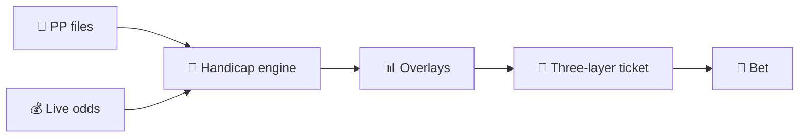

<div align="center">

# 🏇 horse-model

### A generalized handicapping engine for thoroughbred racing.

[](https://python.org)
[](https://docs.python.org/3/library/)
[](LICENSE)

[](analysis/case-studies/2026-kentucky-derby/)
[](analysis/case-studies/2026-kentucky-derby/postmortem.md)
[](analysis/case-studies/2026-kentucky-derby/postmortem.md)
[](https://claude.com/code)

</div>

> Started Derby Day 2026 as a five-hour public build. Picked the winner (Golden Tempo, 25-1). Net +$435 on an $85 ticket. Now generalized for any race — drop in a config + parsed PPs and the same pipeline runs.

---

## 🎯 What this is

A feature-scored softmax handicap model + edge-first portfolio constructor. Parse the PPs, score the field, strip takeout from live odds, find horses where our number says the public is wrong, bet the overlays. Built in pure Python (stdlib + matplotlib), runs on any race via a TOML config.



The premise: **strip the takeout, find the overlays, size with discipline, document everything.**

---

## ⚡ Quick start

```bash
git clone https://github.com/nigelglenday/horse-model
cd horse-model

# Run the full pipeline against frozen Derby data
python3 src/handicap.py    --race 2026-kentucky-derby
python3 src/sensitivity.py --race 2026-kentucky-derby
python3 src/exacta.py      --race 2026-kentucky-derby
python3 src/trifecta.py    --race 2026-kentucky-derby
python3 src/portfolio.py   --race 2026-kentucky-derby --bankroll 85 \
                           --target-spend 85 --include-tri \
                           --top-pick-wheel 8 --longshot-scan 7
python3 src/charts.py      --race 2026-kentucky-derby
```

You'll get the same overlays and ticket structure that picked the 2026 Derby winner. No external dependencies beyond `matplotlib`.

---

## 🛠️ Run on a new race

> **Status:** the engine is ready. PP parsing is currently hand-transcribed (a real PDF parser is a v3 project). Workflow:

| | |
|---|---|
| **1.** | Create `data/races/<your-race-slug>/` |
| **2.** | Copy `data/races/2026-kentucky-derby/config.toml` as a template; tune for your race (post bias, weights, preferred-prep race class) |
| **3.** | Parse the Equibase PP into `field.csv` + `past_performances.csv` (see schema in either file) |
| **4.** | `python3 src/fetch_odds.py --race <slug>` — prints instructions for pulling live odds |
| **5.** | Pull live odds (most tote sites are JS-rendered → use Claude Code's WebFetch or paste manually) into `live_odds.csv` |
| **6.** | Pull exacta probables from Xpressbet (or equivalent) into `exacta_probables.txt` (24×24 grid) |
| **7.** | Run the pipeline (handicap → sensitivity → exacta → trifecta → portfolio → charts) |
| **8.** | Review against [`learnings/index.md`](learnings/index.md) — accumulated cross-race wisdom |
| **9.** | Place bets, then write your own `learnings/<slug>.md` post-race |

A scaffolded Preakness 2026 config is ready at [`data/races/2026-preakness/config.toml`](data/races/2026-preakness/config.toml).

---

## 📐 Architecture

Three layers of wagering, by design — none collapsing into another:

<div align="center">

| Layer | What | Why |
|:---:|---|---|
| 1️⃣ | **Kelly core** — variance-optimal stakes via fractional Kelly | Mathematically rigorous, conservative, optimal long-run growth |
| 2️⃣ | **Satellite spread** — minimum-stake bets on high-EV combos Kelly says skip | Captures positive-EV combos individually too small to size meaningfully |
| 3️⃣ | **Heuristics** — top-pick wheel + longshot scan | Operationalizes structural rules: top overlay → top of trifecta; under-bet placers → exacta wheel |
| ➕ | **Human judgment** — story features, live-day context, risk tolerance | Always overrides. The model is an abstraction; the race is the territory. |

</div>

Validated on Derby 2026: 3-layer ticket would have captured **96% of the actual hand-tuned upside** ($418 of $435), entirely systematically. Pure quarter-Kelly captures 3%.

> **For full architecture details, system diagrams, and module reference:** [`docs/ARCHITECTURE.md`](docs/ARCHITECTURE.md)

---

## 📚 Repository layout

```
horse-model/
├── 📄 CLAUDE.md          # AI assistant orientation
├── 📄 README.md          # this file
├── 📁 src/               # race-agnostic engine (pure Python)
├── 📁 data/races/<slug>/ # per-race config + data + outputs
├── 📁 analysis/
│   ├── case-studies/     # frozen race narratives
│   └── figures/          # per-race visualizations
├── 📁 learnings/         # cross-race priors, compounding wisdom
├── 📁 docs/              # architecture + diagrams
└── 📁 prompts/           # the Derby-Day seed prompt (frozen)
```

---

## 🛣️ Status

<div align="center">

| Phase | Description | Status |
|:---:|---|:---:|
| v1 | Single-race hardcoded build (Derby Day) | ✅ |
| v2 | Generalized config-driven engine | ✅ |
| v2.1 | Kelly portfolio + trifectas + 3-layer wagering | ✅ |
| v2.1 | AE-penalty bug fix, fetch-odds helper | ✅ |
| v2.1 | Preakness 2026 scaffold | ✅ |
| v3 | PDF parser (replace hand-transcription) | 🔜 |
| v3 | Story features (owner / trainer firsts) | 🔜 |
| v3 | Historical-Derbies weight fitting (real Bayesian) | 🔜 |
| v3 | Live-odds reactive bet sizing | 🔜 |

</div>

---

## 🧠 Earned priors (read these)

These are wisdom carried forward from races we've actually bet. Don't relearn them.

- **Sensitivity "ROCK SOLID" ≠ model is right.** Necessary, not sufficient.
- **Live-tote drift on the favorite is signal, not noise.** Public sees what linemakers miss.
- **Star-jockey/trainer overbet is bigger than the model alone captures.** Live odds reveal it directly.
- **AE-activated horses are real starters.** Drop the AE penalty when live odds confirm.
- **Top-overlay horses deserve to be top-of-trifecta.** Asymmetry rule.
- **Bankroll is a scalar, not a structural constraint.** Optimize first, scale second.
- **Story matters; surface it.** Biographical features predict public-money flow.
- **Beware Whitehead's Misplaced Concreteness.** The Beyer figure is an *abstraction* of speed, not speed itself. Always ask: what is the model not seeing?

Full version: [`learnings/index.md`](learnings/index.md)

---

## 🤖 For new AI sessions

[`CLAUDE.md`](CLAUDE.md) is the orientation file — auto-loaded by Claude Code, intended as the entry point for any new AI assistant session. Carries project context, common workflows, accumulated wisdom, and a replaceable user-context section.

The Derby-Day seed prompt stays frozen at [`prompts/derby-day.md`](prompts/derby-day.md) as the historical artifact.

---

## 📋 Data attribution

Past performance source data is from **Equibase Company LLC**, copyright 2026, all rights reserved. Raw PP files (`data/races/*/raw/*.pdf` and intermediate text dumps) are gitignored — get your own. The structured CSVs in `data/races/<slug>/` are derivative analytical extracts: factual fields (dates, distances, Beyer figures, finish positions) reorganized into our schema for non-commercial analytical and educational purposes. **Beyer Speed Figures** are a registered analytical product of Daily Racing Form / Equibase. This repository is fair-use academic-style analysis; not a substitute for a paid PP subscription, not a republication of Equibase's compiled data, not commercial.

---

<div align="center">

**MIT licensed.** Made on Derby Day 2026, generalized for the Preakness and beyond.

🐎🐎🐎

</div>
