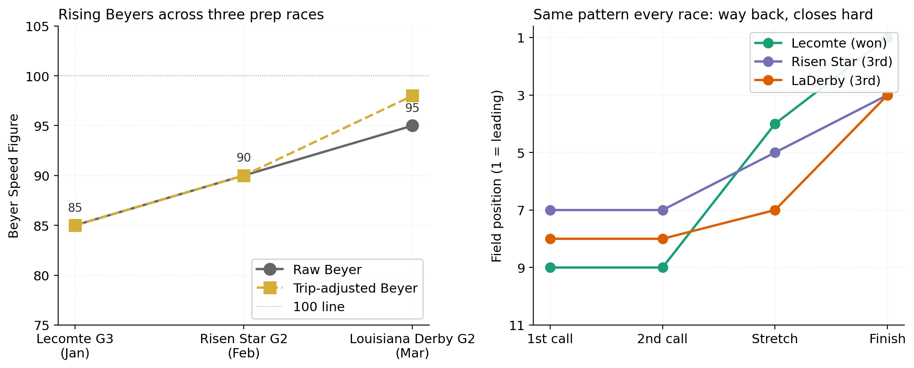

# Why the model picked Golden Tempo

Cardinal model: 5.7% fair win prob. Live market: 3.0%. Overlay 1.99x. Sensitivity scan: ROCK SOLID across 200 weight perturbations.

Six signals stacked. None individually decisive. Together they outweighed his unimpressive headline Beyer.

## 1. Rising Beyers, three in a row

| Race | Distance | Beyer | Trip-adjusted |
|---|---|---|---|
| Lecomte G3 (Jan) | 8.5F | 85 | 85 |
| Risen Star G2 (Feb) | 9.0F | 90 | 90 |
| Louisiana Derby G2 (Mar) | 9.5F | 95 | **98** |

Three races, three improvements. The public sees the absolute number (95) and compares to Renegade and Further Ado at 107. The model sees the slope.

## 2. Closer style. Pace projected to melt down.

Position calls every race: way back early, hard close. Same pattern.

| Race | 1st call | 2nd call | Stretch | Finish |
|---|---|---|---|---|
| Lecomte | 9th | 9th | 4th | **1st** |
| Risen Star | 7th | 7th | 5th | 3rd |
| LaDerby | 8th | 8th | 7th | 3rd |

The model projected a hot pace (4 confirmed front-runners: Pavlovian, Litmus Test on first-time blinkers, Six Speed, Robusta). Closers benefit from a meltdown. Pace fit feature scored him 90 of 100.

## 3. Trip adjustment on his last race

LaDerby comment from the chart caller: *"wsqzd st 4w-ins willing"*. Squeezed at the start, then 4-wide, then closed willingly. Trip adjustment math: +2 for the squeeze, +1 for 4-wide. Adjusted Beyer 98, not 95.

## 4. Curlin sired

Curlin progeny carry distance well. The sire bias config gave Golden Tempo a +10 distance fit bonus. The public discounts pedigree relative to recent form.

## 5. Jockey upgrade. Quiet trainer.

Jose Ortiz (jockey score 78) replaced J.J. Ortiz on a 30-1 horse. Cherie DeVaux (trainer score 55) had no Derby win narrative entering the race. Star-name premiums depress overlay potential. Golden Tempo had no star tax.

## 6. Live odds barely moved

ML 30-1, live 25-1. Almost no public action on him. Compare to:

| Horse | ML | Live | Implied prob shift |
|---|---|---|---|
| So Happy | 15-1 | 5-1 | +10.4 pp |
| Commandment | 6-1 | 5-1 | +2.4 pp |
| Chief Wallabee | 8-1 | 6-1 | +3.2 pp |
| **Golden Tempo** | **30-1** | **25-1** | **+0.6 pp** |

The public was loading on three named-trainer favorites. Golden Tempo stayed at his morning-line price. The market's silence was a sixth signal.

## What aggregated to "ROCK SOLID"

No single signal screamed. Five moderate ones stacked plus one negative signal (the public ignoring him) produced the overlay. Sensitivity scan confirmed the conclusion held under most weight choices.

## What the model didn't predict

Golden Tempo winning specifically. The model identified him as a horse mispriced relative to his profile. Winning required:

- The pace to materialize hot enough to favor closers
- Renegade trapped at post 1 (which the post-1 multiplier expected)
- Further Ado not showing up (the model had no signal for that)
- The three public favorites all underperforming

Edge identification is not outcome prediction. The model said *if* the race shape goes a certain way, this 25-1 horse is mispriced. The race shape went that way. He won.

## What this means for the next race

- Look at Beyer slope, not just the level
- Project pace from confirmed front-runners and weight closer style accordingly
- Trip-adjust the most recent fig before comparing across the field
- Read live-tote drift as the sixth signal: silence is information
- Stacked moderate signals can outweigh one big number

The full pre-race readout: [Pre-race handicap](readout.md). The bet structure: [Wagering strategy](wagering.md). The honest accounting of what the model got wrong: [Post-mortem](postmortem.md).
