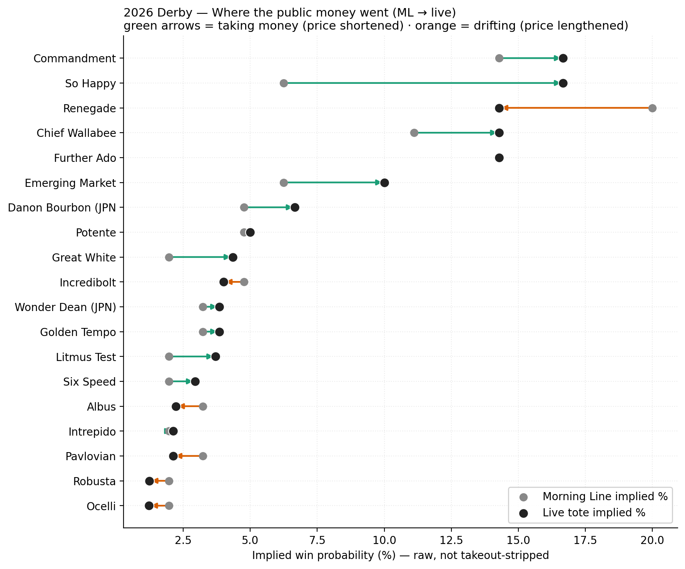
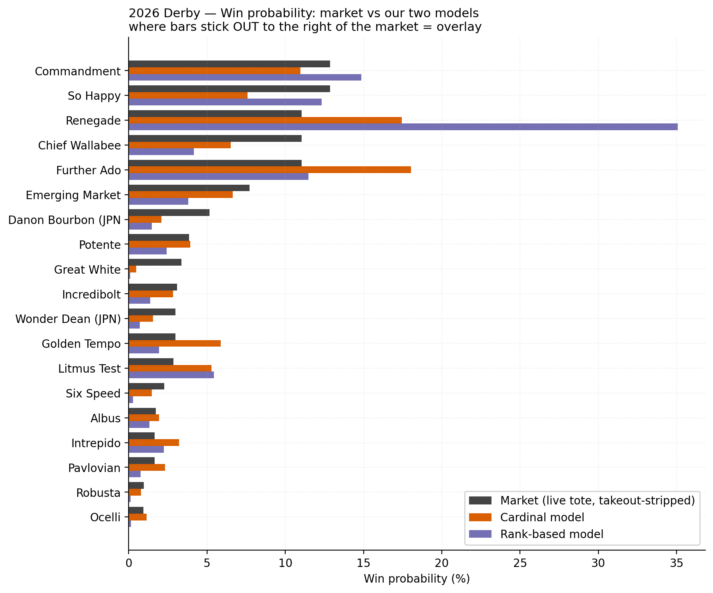
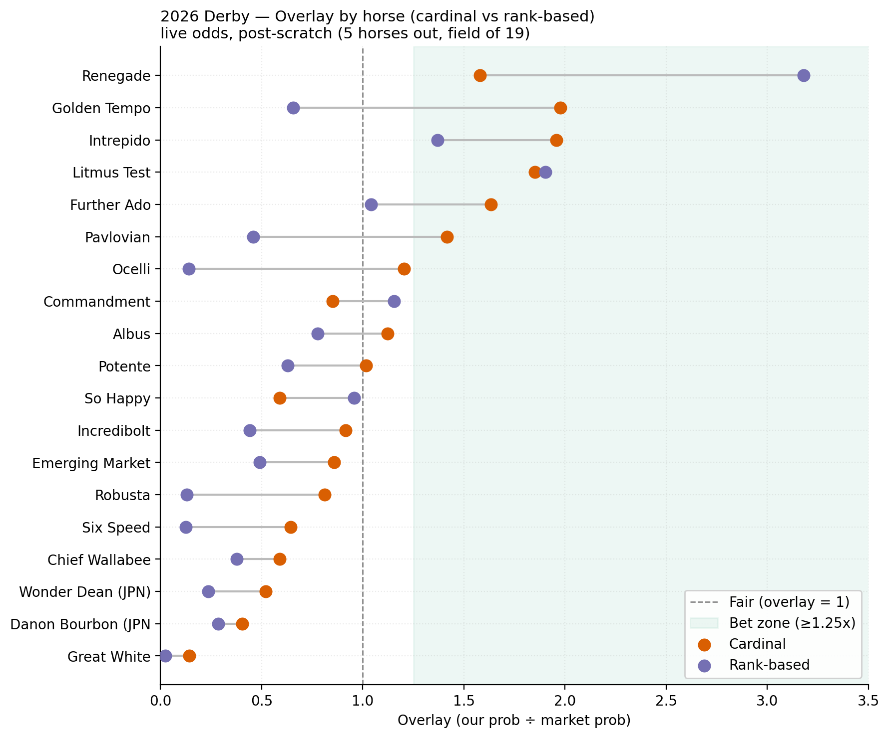
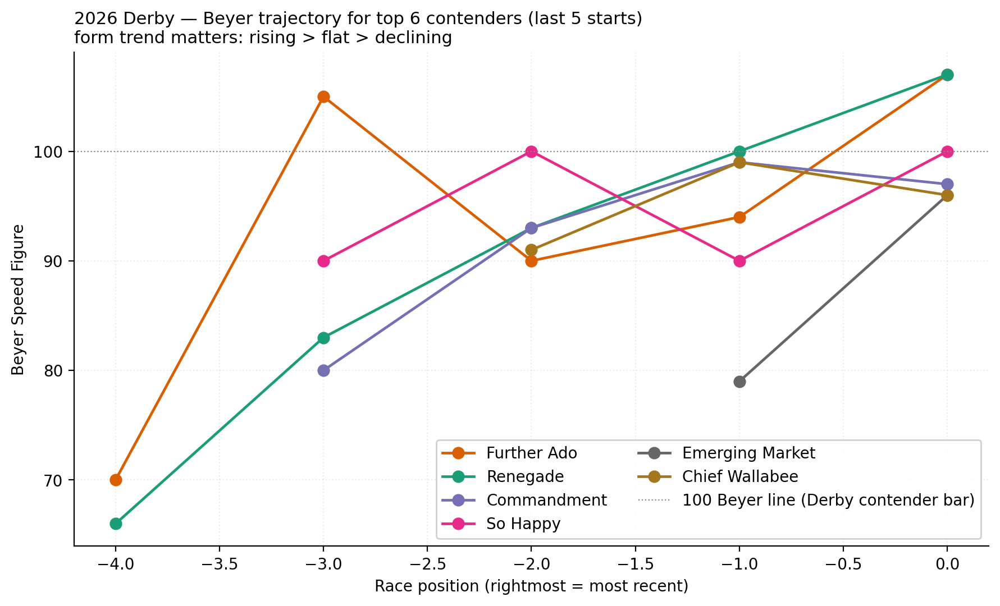

# 2026 Kentucky Derby — Pre-Race Readout

**Race 12, Churchill Downs · Saturday May 2, 2026 · post 6:57 PM ET · 1¼ miles · $5M Grade I**

This is the readout the model produced ~2 hours before post. Built live with Claude Code as part of the [horse-model](../README.md) public build. Bets and reasoning recorded *before* the race, so the post-mortem can be honest.

## What changed during the day

5 horses scratched (Right to Party, The Puma, Silent Tactic, Fulleffort, Corona de Oro) — field down to **19 starters**, the sixth time in eight years the Derby has gone with under 20.

Two of those scratches (Silent Tactic and Fulleffort) were our top overlays under morning line. They evaporated. The math had to be re-run with live tote odds replacing ML.

## Where the public money went

Reading this chart:
- **Green arrows = took money** (price shortened, more public confidence)
- **Orange arrows = drifted** (price lengthened, public abandoned)

The biggest signals:
- **So Happy 15-1 → 5-1.** Mike Smith name premium. Likely overbet past fair.
- **Litmus Test 50-1 → 26-1.** Baffert tax. The morning line was wrong; the public arbitraged it.
- **Chief Wallabee 8-1 → 6-1.** Wm Mott + first-time-blinkers narrative drew money.
- **Renegade 4-1 → 6-1.** ⚠️ The favorite *drifted*. The public is avoiding the chalk — almost certainly because of post 1 (see Caveats below).
- **Commandment 6-1 → 5-1.** Cox + perfect form took money.

The Renegade drift is the single most actionable piece of information on the day. The model still rates him near the top; the market lost faith. Whether the market is right depends on how much weight post 1 deserves.

## The model's read on win probability

Three bars per horse: live tote (after takeout strip), our cardinal model, our rank-based model. **Where our bars stick out to the right of the market bar = overlay.**

The Renegade rank-bar (purple) is the most extreme — the model thinks he's a 35% horse and the market priced him at 11%. Cardinal model agrees less aggressively but still has him as an overlay.

The flip side: **Chief Wallabee, So Happy, and Commandment all show the market bar dominating both model bars** — those are confirmed overbets.

## Where to bet

The bet zone is overlay ≥ 1.25x. Both methods agree on:

| Horse | Live odds | Cardinal overlay | Rank overlay | Read |
|---|---|---|---|---|
| **#1 Renegade** | 6-1 | 1.58x | **3.18x** | The drift created the bet. Both methods agree, rank is screaming. |
| **#4 Litmus Test** | 26-1 | 1.85x | 1.90x | Longshot value with first-time blinkers, Baffert overlay still real after the price move. |
| **#18 Further Ado** | 6-1 | 1.63x | 1.04x | Cardinal-only. 107 Beyer last out, Cox barn-pick (Velazquez ride). |
| **#19 Golden Tempo** | 25-1 | 1.98x | 0.66x | Cardinal-only. Public never found him. |

Confirmed fades (do NOT bet to win, candidates to bet AGAINST in exotics):
- **#8 So Happy** — public hammered him to 5-1 on Mike Smith name + cheerful name + recent SADerby
- **#12 Chief Wallabee** — heaviest single overbet on the board
- **#6 Commandment** — slight overbet, though "perfect form" narrative is real

## Caveats — what the model is probably under-penalizing

### Post 1 risk on Renegade

Renegade drew the rail. **Since the field expanded to 20 in 1975, post 1 has produced exactly one Derby winner (Ferdinand, 1986)** — a 2% strike rate vs the 5% random expectation. Post 1 underperforms by 50-60%.

The model penalizes post 1 (score 40 vs 90 for posts 5-15, weighted at 5%) but **probably not enough**. If the post-1 penalty were doubled, Renegade's cardinal overlay would shrink from 1.58x to roughly 1.20x — still a bet, but a thin one. The wagering ticket compensates by sizing Renegade's win bet at $25 (not $40+) and hedging into Further Ado and Litmus Test in the exotics. Full treatment in [`derby-2026-wagering.md`](derby-2026-wagering.md).

Why post 1 is a graveyard at CD: first turn comes ~3/16 mile out, the rail can be dead by Derby Day from a meet's worth of training, and 18 horses fanning right while you're stuck inside forces a lose-lose decision tree.

### Harville place-probability assumption

The exacta math assumes P(j places | i wins) = p_j / (1 − p_i), proportionally. **It doesn't account for running style × pace fit on placement.** Litmus Test is a confirmed front-runner; in a 19-horse field with 4 confirmed E's, he likely doesn't get the lead, and without it his form line says he flattens. **His true place probability is probably ~30% lower than Harville suggests** — which deflates the Litmus-Test-underneath exacta overlays by the same.

Even discounted, those combos remain positive EV — but the headline payouts ($588, $483, $254) are best-case, not expected.

### Live odds will keep moving

These probabilities are based on a tote snapshot taken ~2.5 hours before post. The overround in this snapshot is ~30% (high). Last-15-minute money is heavy on Derby Day; expect another ~10-15% of total handle to land in the final five minutes, mostly chasing the favorites. Re-pull right before betting.

## Form

The trajectory chart shows last-five-Beyers per top contender. The story: Renegade and Further Ado have ascended together to a 107 ceiling — the two clear top figs in the field. Chief Wallabee's 99 ceiling is below them. Commandment is steady but capped near 99. So Happy bounces between 90 and 100.

After trip adjustment from comments (4-wide trips, "ridden out" finishes, slipped breaks), Further Ado pushes to 109 and Renegade to 108 — still the clear top two.

## Method, in one sentence

Score each horse on 11 weighted features (trip-adjusted Beyers, projected pace fit under a meltdown thesis, class of preps won with a Florida Derby bias, manner of finish, distance fit, connections, equipment changes, post position, plus a Cox-stable barn-pick signal), softmax across the field, compare to live tote prices stripped of takeout. Bet only the overlays.

The detailed walkthrough is in [`src/handicap.py`](../src/handicap.py).

## Wagering plan

The actual ticket structure ($100 budget, exacta math, post-1 caveat) lives on its own page: [`derby-2026-wagering.md`](derby-2026-wagering.md).

## Status

Mid-race-day. This file is the snapshot of what we're betting and why. Post-race, this writeup gets the result appended — what landed, what we got right, what we got wrong, what we'd change.

If the token spend doesn't clear the net winnings, the loss has at least been honestly logged in public.
