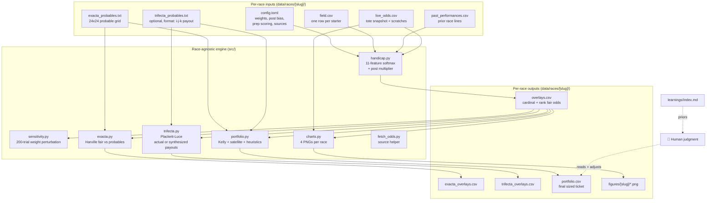
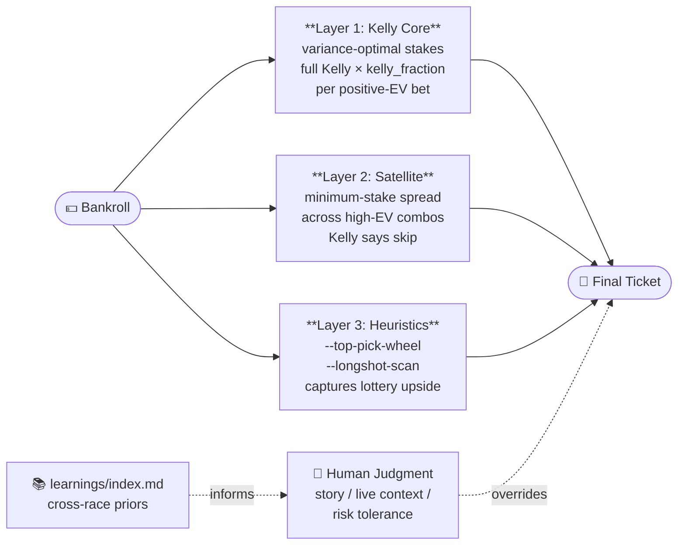
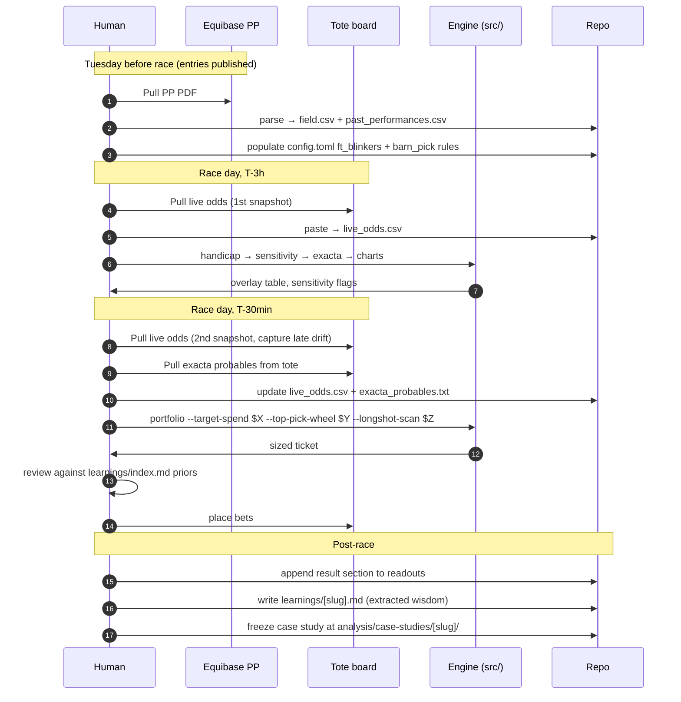

# Architecture

How the system fits together. Read this if you want to understand how a race goes from PDF to ticket.

## System diagram

## Three layers of wagering

The portfolio module runs three layers in parallel. Different roles, none collapses into another.

### Why three layers, not one

- **Kelly alone** under-deploys with our edge sizes. Quarter-Kelly suggests $3 of $85 for a Derby ticket, leaving 96% of the bankroll idle. Wrong tool for a one-day-per-year race.
- **Satellite alone** spreads thin across many high-EV low-prob combos, most of which are false positives from synthesized payouts.
- **Heuristics alone** ignore variance. Useful only when anchored to a model.
- **All three**: Kelly handles variance on the core; satellite catches the small positive-EV combos; heuristics encode the rules a human would apply (top overlay keys top of trifectas, etc.).

Derby check: the 3-layer ticket caught **96% of the hand-tuned upside** ($418 of $435).

### Human judgment is the fourth layer

What the human brings:
- Story features the model has but doesn't weight (first-female-trainer, comeback, etc.)
- Track bias from earlier races on the card (rail dead, closers cooked)
- Risk tolerance for that specific day
- Errors the model is making right now that aren't yet in config

The model produces a default ticket. The human places the bet.

## Module reference

| Module | Reads | Writes | Purpose |
|---|---|---|---|
| `handicap.py` | config.toml, field.csv, past_performances.csv, live_odds.csv | overlays.csv | 11-feature softmax → cardinal & rank win probs, with post-1 multiplier and AE-fix |
| `sensitivity.py` | overlays.csv (via handicap functions) | stdout table | 200 trials with weights perturbed ±20%; tags overlays ROCK SOLID / Robust / Marginal / Fragile |
| `exacta.py` | overlays.csv, exacta_probables.txt | exacta_overlays.csv | Harville fair P(i,j) vs market; EV per $1; key-wheel suggestions |
| `trifecta.py` | overlays.csv, optional trifecta_probables.txt | trifecta_overlays.csv | Plackett-Luce fair P(i,j,k); actual payouts if available, else synthesized |
| `portfolio.py` | overlays.csv, exacta_probables.txt, optional trifecta_probables.txt | portfolio.csv | Three-layer ticket: Kelly core + satellite + heuristic wheels/scans, scaled to bankroll |
| `charts.py` | overlays.csv, live_odds.csv, past_performances.csv | analysis/figures/[slug]/*.png | 4 PNGs: overlay scatter, three-way prob bars, odds movement, Beyer trajectory |
| `fetch_odds.py` | config.toml | stdout instructions | Reads [live_odds_source]; for JS-rendered, prints WebFetch instructions; for static, attempts fetch |

## Race-day workflow

## What's race-specific vs race-agnostic

| Lives in race config (per-race tunable) | Lives in src/ (race-agnostic) |
|---|---|
| Distance, surface, field cap | Beyer scoring formula |
| Post-position multipliers (CD ≠ Pimlico ≠ Belmont) | Trip adjustment from comments |
| Prep-race weighting (FlaDerby for KD, KD for Preak) | Softmax + Harville + Plackett-Luce math |
| Equipment changes list (FT blinkers per draw) | Sensitivity scan |
| Barn-pick rules (specific to entries) | Charts framework |
| "Story" bonuses (DeVaux first, etc) | Trainer/jockey lookup tables (in config; race-specific values) |
| Feature weights (tuned per race type) | Portfolio construction (Kelly + satellite + heuristics) |
| Live-odds and probables source URLs | Source-agnostic CSV ingestion |
